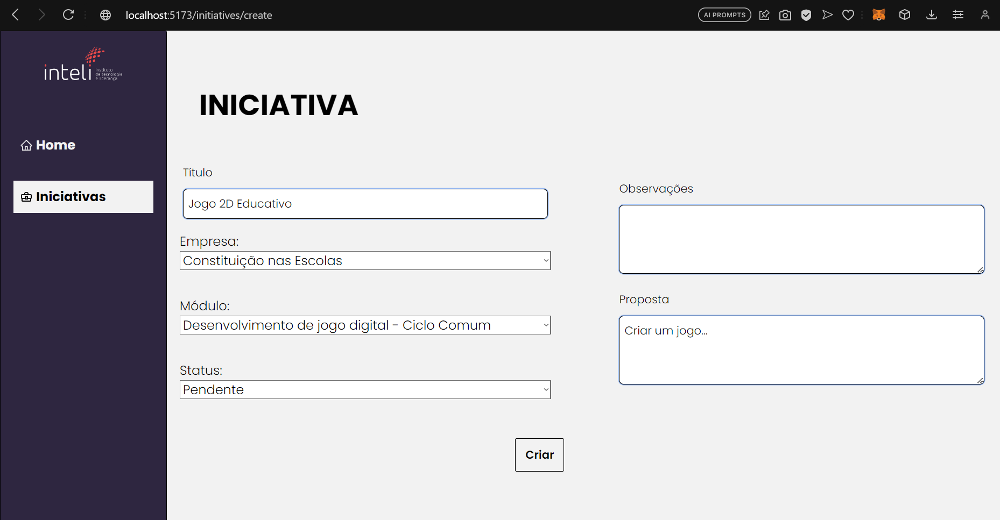
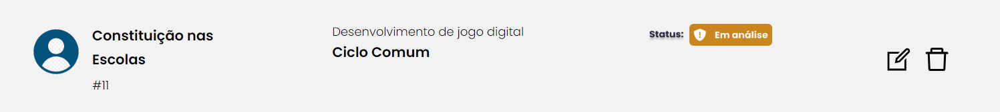
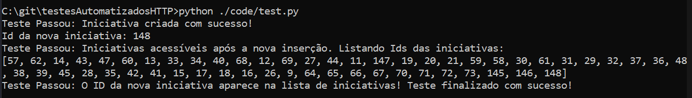

# Testes Automatizados

## Objetivo
Verificar se um usuário pode criar uma nova iniciativa na aplicação.

## Pré-condição
As iniciativas devem estar listadas e visíveis na tela respectiva.

## Procedimento de Teste Manual

1. Verificar se as iniciativas estão listadas na tela.
2. Clicar no botão "Criar +".
3. Preencher os campos obrigatórios, como Título, Empresa, Módulo e Status, com os seguintes valores:
   - Título: "Criação de Website de Vendas"
   - Empresa: "MRV"
   - Módulo: "Projeto de Arquitetura de Software - Engenharia de Software"
   - Status: "Pendente"
4. Clicar no botão "Criar".

# Resultado do Teste Manual

**Resultado Esperado**
A iniciativa deve ser criada com sucesso, e o usuário deve ser redirecionado para a página de listagem de iniciativas, onde a nova iniciativa deve ser exibida ao final da página.

**Resultado Obtido**
[Descreva aqui o resultado obtido após a execução do teste automatizado. Por exemplo, se o teste passou ou falhou, e quaisquer observações relevantes.]

**Pós-condição**
O sistema agiu como o esperado, não sendo necessário nenhuma operação adicional.

## Procedimento de Teste Automatizado

1. Opcional - Verificar se as iniciativas estão listadas na tela (frontend).
2. Alterar os dados do dicionário "criar_iniciativa", no arquivo [test.py](code/test.py), para os valores desejados para o teste.
Ex.:
    - "name": "Criação de Website de Vendas",
    - "status": "PENDING",
    - "description": "Este website será criado para aumentar as vendas da empresa.",
    - "observation": "Utilizar FastAPI para criar a API do website.",
    - "company_id": 42,
    - "module_id": 28
4. Salvar as alterações, e executar o script pelo terminal com o comando `python3 test.py`. 

# Resultado do Teste Automatizado

**Resultado Esperado:** O console deve apresentar o id da nova tarefa criada, e este deve estar contido na lista de ids das iniciativas. Desta forma, o teste será concluído com sucesso.

**Resultado Obtido:** O teste passou com sucesso. A nova tarefa foi criada com a seguinte menságem: "Teste Passou: O ID da nova iniciativa aparece na lista de iniciativas! Teste finalizado com sucesso!".

**Pós-Condição**
O sistema agiu como o esperado, não sendo necessário nenhuma operação adicional.

# Imagens

Tela de criação de iniciativas

Iniciativa criada

Teste automatizado finalizado com sucesso
